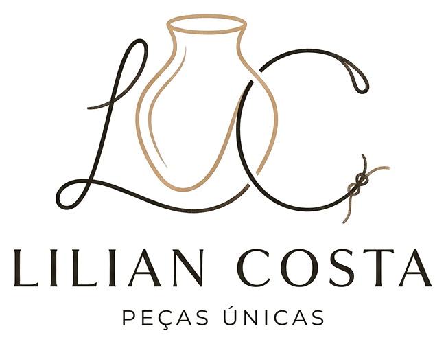

# 🌿 Lílian Costa — Artesã de Peças Únicas & Design Afetivo

<p align="center">
  
</p>

<p align="center">
  <strong>Onde o afeto molda a matéria e a sua casa ganha alma singular.</strong>
</p>

<p align="center">
  <a href="#-sobre-o-projeto">Sobre</a> •
  <a href="#-principais-funcionalidades">Funcionalidades</a> •
  <a href="#-arquitetura-e-tecnologias">Tecnologias</a> •
  <a href="#-estrutura-do-projeto">Estrutura</a> •
  <a href="#-como-executar-localmente">Como Rodar</a> •
  <a href="#-autor">Autor</a>
</p>

---

## 📖 Sobre o Projeto

Landing page institucional e catálogo interativo desenvolvido para a artesã **Lílian Costa**. O projeto foi concebido para transmitir a elegância, o carinho e a sofisticação do artesanato afetivo de alto padrão — unindo macramê, fibras naturais, madeira nobre e arranjos florais à decoração de interiores.

A aplicação conta com uma experiência rica e imersiva para o visitante, apresentando um showcase interativo de ambientes planejados (fachada, sala, sala de jantar, quarto) e uma galeria dinâmica com detalhes, fotos e botão direto para encomenda personalizada via WhatsApp.

---

## ✨ Principais Funcionalidades

- **🏡 Showcase de Ambientes (House Tour Interativo):**
  - Navegação visual por cômodos da casa, mostrando como cada peça artesanal compõe os ambientes reais.
- **🖼️ Galeria Dinâmica de Peças & Coleções:**
  - Filtros por categoria (Macramê, Mesa Posta, Madeira & Fibras, etc.).
  - Modal imersivo com detalhes da peça, materiais utilizados, dimensões e história de criação.
- **💬 Gerador Dinâmico de Pedidos via WhatsApp:**
  - Ao clicar em "Encomendar" em qualquer peça ou ambiente, um link direto para o WhatsApp é criado com uma mensagem contextualizada automática já preenchida.
- **📱 Design 100% Responsivo & Mobile First:**
  - Layout otimizado para celulares, tablets e desktops com drawer menu suave.
- **🎨 Identidade Visual Premium:**
  - Tipografia refinada (*Cormorant Garamond* e *Plus Jakarta Sans*), micro-interações, paleta orgânica (terracota, linho, verde sábia) e animações fluidas.

---

## 🛠️ Arquitetura e Tecnologias

O projeto foi construído seguindo princípios de **Clean Architecture** e boas práticas de engenharia de software moderno, utilizando tecnologias nativas para garantir máxima performance, leveza e ausência de dependências pesadas:

- **HTML5 Semântico:** Acessibilidade (a11y), SEO e Open Graph tags para compartilhamento em redes sociais.
- **CSS3 Puro (Vanilla CSS):**
  - Design Tokens (variáveis CSS para cores, tipografia, espaçamentos e sombras).
  - Arquitetura de estilos modular (`tokens.css`, `base.css`, `animations.css`, componentes isolados).
- **JavaScript Moderno (ES6+ Modules):**
  - Separação em camadas: `Domain`, `Data`, `Core` e `Presentation`.
  - Gerenciamento de eventos desacoplado através de um `EventBus`.

---

## 📁 Estrutura do Projeto

```text
├── imagens/                     # Banco de fotos originais de produção
├── src/
│   ├── assets/                  # Imagens otimizadas (WebP/PNG), logos e banners
│   │   ├── ambients/            # Imagens dos ambientes planejados
│   │   ├── brand/               # Logos e identidades da marca
│   │   └── pieces/              # Fotos dos produtos e artesanatos
│   ├── core/                    # Configurações globais e barramento de eventos (EventBus)
│   ├── data/                    # Repositórios e fontes de dados mockados/estruturados
│   │   ├── repositories/
│   │   └── sources/             # Catálogo de peças e ambientes
│   ├── domain/                  # Entidades, modelos e casos de uso de negócio
│   │   ├── models/
│   │   └── usecases/            # Regras como CreateWhatsAppLink e GetPieces
│   └── presentation/            # Controladores de UI e estilos
│       ├── controllers/         # Gallery, House Showcase, Modal, App Controllers
│       └── styles/              # CSS modular (tokens, base, components)
├── index.html                   # Documento principal da landing page
└── README.md                    # Documentação do projeto
```

---

## 🚀 Como Executar Localmente

Como o projeto é estático e utiliza JavaScript ES Modules nativo, basta executá-lo através de qualquer servidor local simples:

### Opção 1: Usando Python (já disponível na maioria dos sistemas)
```powershell
python -m http.server 3000
```
Depois, abra no navegador: [http://localhost:3000](http://localhost:3000)

### Opção 2: Usando Node.js / npx
```powershell
npx serve .
```

### Opção 3: Extensão Live Server (VS Code)
Basta clicar com o botão direito no arquivo `index.html` e selecionar **"Open with Live Server"**.

---

## 🌐 Publicação (Deploy)

Para publicar o projeto online gratuitamente utilizando o **GitHub Pages**:
1. No repositório no GitHub, acesse **Settings** > **Pages**.
2. Na seção **Branch**, selecione `main` e a pasta `/(root)`.
3. Clique em **Save**.
4. O link público será gerado automaticamente pelo GitHub.

---

## 👤 Autor

Desenvolvido com carinho por **[Luan Carlos](https://github.com/LuanCarlosDev)**.
